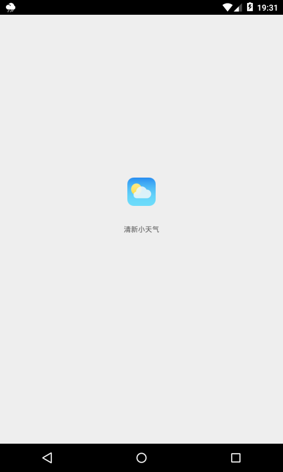
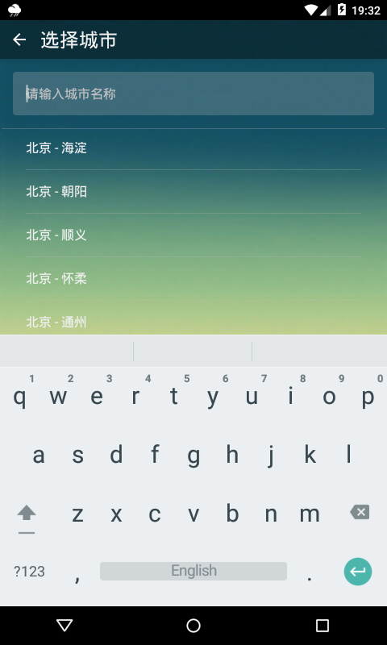
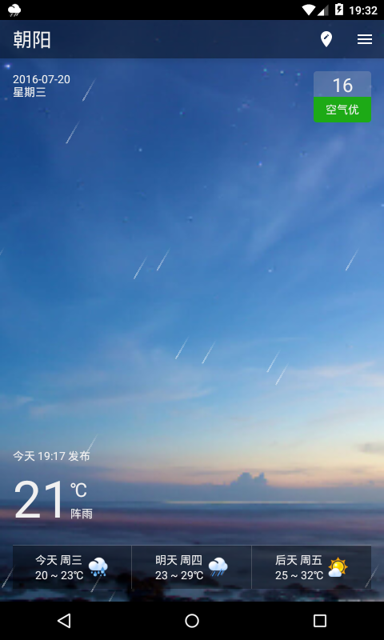
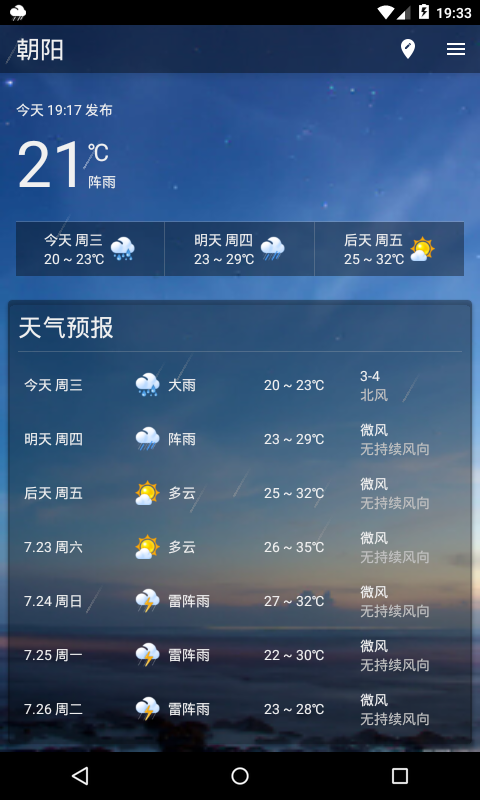
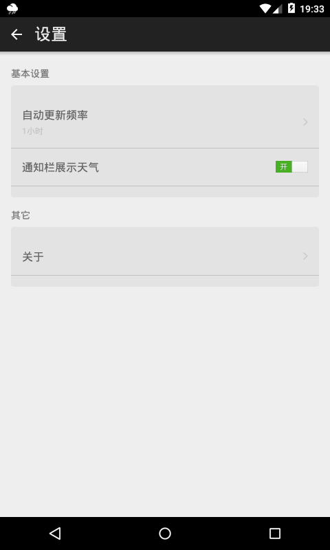
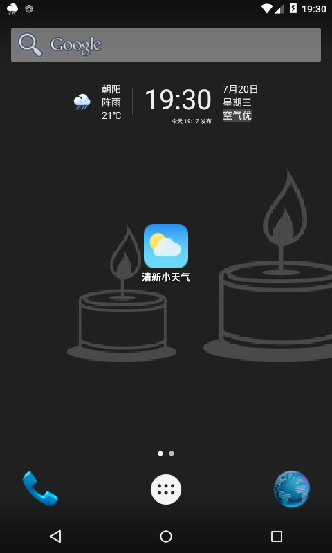
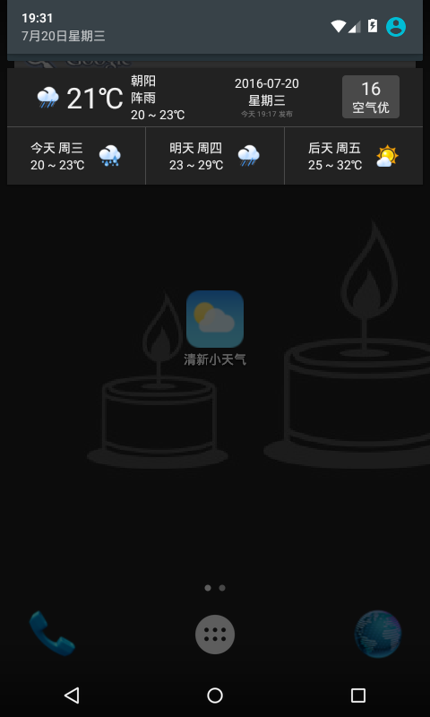

LittleFreshWeather
===================
注意咯~~ 已适配最新和风天气接口，可以接着用啦 ^^ 
-----------------------------------------------------
这是一款简洁的天气预报app--**`清新小天气`**，它能够支持国内绝大多数城市，提供包含实时天气、七天预报、实时气象信息及生活指数等预报信息。。。广告编不下去了-_-!!。。。直接上图：  

*   启动画面 

  
*   城市选择 

  
*   当前天气 

  
*   天气预报 

  
*   气象信息及生活指数 

  
*   设置 

  
*   桌面小程序 

  
*   通知栏 

UI（No Material Design）
=======================

由于没有设计天分，又因为本人比较喜欢360系的UI，所以暂时借鉴了360天气的设计风格。火热的Material Design神马的，好是好，但是没有时间一点点弄，以后版本再说吧。。。

整洁架构（The Clean Architecture）
=================================

采用了Bob蜀黍的[**The Clean Architecture**](https://8thlight.com/blog/uncle-bob/2012/08/13/the-clean-architecture.html)(整洁架构)，架构的具体实现方案也是在拜读了诸多前辈文章的基础上完成的，此处表示感谢：
*	[Architecting Android…The clean way? – Fernando Cejas](http://fernandocejas.com/2014/09/03/architecting-android-the-clean-way/)
*	[Architecting Android…The evolution – Fernando Cejas](http://fernandocejas.com/2015/07/18/architecting-android-the-evolution/)
*	[A useful stack on android #1, architecture · Saúl Molinero](http://saulmm.github.io/2015/02/02/A-useful-stack-on-android-1,-architecture/)

数据来源
========

*	定位采用[高德地图定位SDK](http://lbs.amap.com/api/android-location-sdk/locationsummary/)
*	天气预报数据来源于[和风天气](http://www.heweather.com/)

依赖的开源技术
==============

*	[Butterknife](http://jakewharton.github.io/butterknife/)
*	[DiskLruCache](https://github.com/JakeWharton/DiskLruCache)
*	[Gson](https://github.com/google/gson/blob/master/UserGuide.md)
*	[Retrofit](http://square.github.io/retrofit/)
*	[RxJava](https://github.com/ReactiveX/RxJava/wiki)

License
=======

    Copyright 2014 zeuschan@126.com All rights reserved.

    Licensed under the Apache License, Version 2.0 (the "License");
    you may not use this file except in compliance with the License.
    You may obtain a copy of the License at

        http://www.apache.org/licenses/LICENSE-2.0

    Unless required by applicable law or agreed to in writing, software
    distributed under the License is distributed on an "AS IS" BASIS,
    WITHOUT WARRANTIES OR CONDITIONS OF ANY KIND, either express or implied.
    See the License for the specific language governing permissions and
    limitations under the License.
